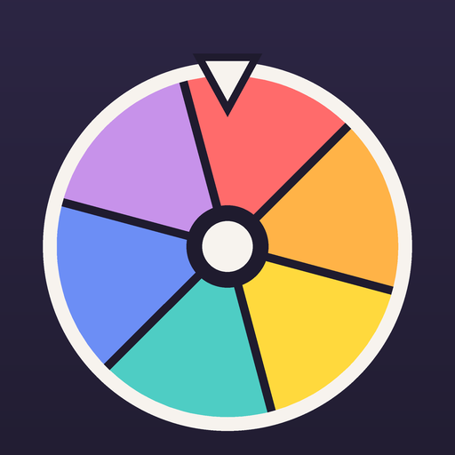

<div align="center">



# 🎡 What next? · Decision Wheel

**¿Qué hacemos? · Ruleta** — spin to decide where to eat, what to do this weekend, or anything else.

</div>

## ✨ Features

- 🎡 **A wheel worth spinning:** flick it or tap *Spin!*; friction physics, a tick and a vibration for
  every slice, confetti at the end
- 📏 **What you see is the real chance:** each slice's size is its probability of winning
- 🔁 **Avoids repeats:** the last three accepted results get a smaller slice (25 %, 50 %, 75 %) for 30 days
- ✋ **Vetoes:** tap an option to take it out of this spin (great in groups)
- 📒 **History:** results you accept with *Let's go!* are kept per wheel
- 📋 **Ready-made wheels** in Spanish and English, plus your own lists
- 🚫 No ads, no tracking, no network: everything stays on the phone
- ⭐ Favourite wheels first, and launcher shortcuts (long-press the icon) to favourite / recent wheels
- ♻️ Restore the example wheels you deleted, without touching your own

## 🏗️ Architecture

| Module | What lives there |
|---|---|
| `domain` | Pure Kotlin: weights (repeats, vetoes), slice geometry, pointer hit test, spin plan and easing, colour slots, tick synth, `AppState` (kotlinx.serialization). Unit tested, including a 20,000-spin check that results match slice sizes. |
| `app` | Compose UI (home, wheel, edit, history, about), one `WheelsViewModel`, DataStore JSON persistence, SoundPool tick, navigation-compose. |

The landing angle of a spin is uniform; the winner is whatever slice ends under the pointer. That
is why slice size = probability, with no hidden weighting.

## 🎨 Design

"Sunset" palette on a night background: coral, orange, sun, teal, blue, lilac (`ui/theme/WheelTheme.kt`).
Neighbouring slices never share a colour, and each option keeps its colour when others are vetoed.

## 🛍️ Store listing

Texts and images in [`store/`](store) (fastlane supply layout). Regenerate after UI changes:

```bash
scripts/emulator.sh start
./gradlew :apps:decision-wheel:app:installRelease
apps/decision-wheel/tools/capture_store_screenshots.sh
.venv/bin/python apps/decision-wheel/tools/generate_store_assets.py
```

## 📦 Commands

See [OPERATIONS.md](OPERATIONS.md). Version history: [release-notes.md](release-notes.md).

Privacy policy: https://jorgelillo7.github.io/privacy/decision-wheel/
